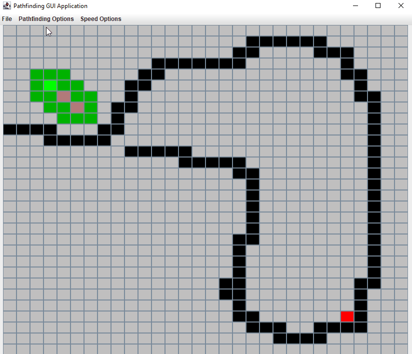
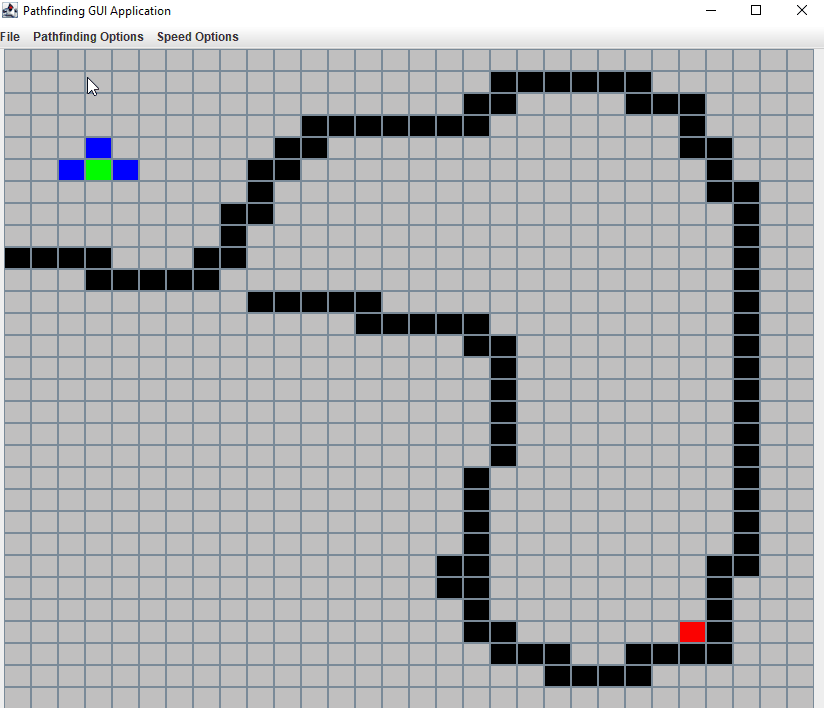

# Pathfinding Visualization

## Introduction
The purpose of this project was to create a visualization tool for the A* and Breadth First Search algorithms.

The A* algorithm is a popular algorithm used to determine the shortest path between two points on a graph, or a grid, which uses heuristics to calculate the best path to take. 

## Demo
### A* 

### Breadth First Search

## Controls
The basic commands can be found within the application (File > About)

Left Click - Invert node status to either being walkable/ wall node.
S - the next left click will place the start node.
E - the next left click will place the end node.

The speed of the algorithm can be adjusted within the Speed Options menu.

The application window's size can be adjusted and each node will be scaled accordingly.